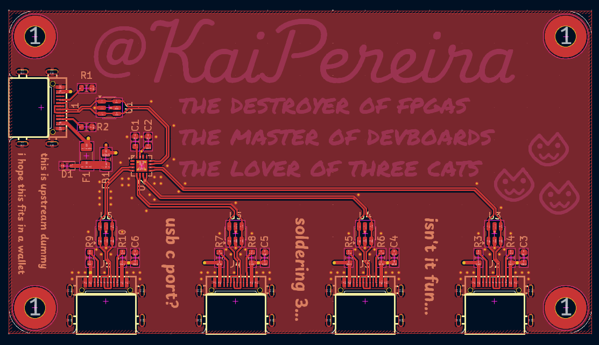
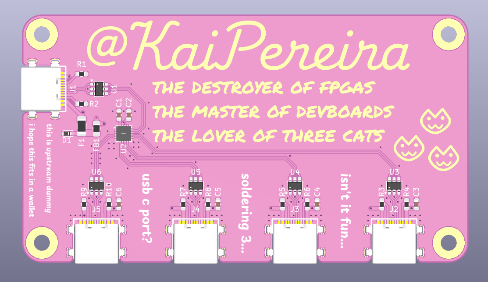
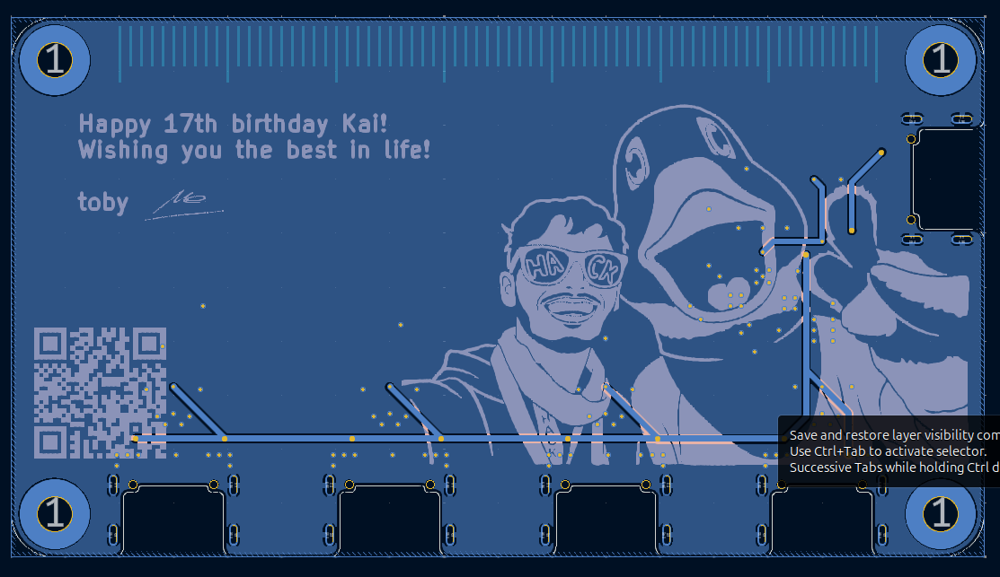
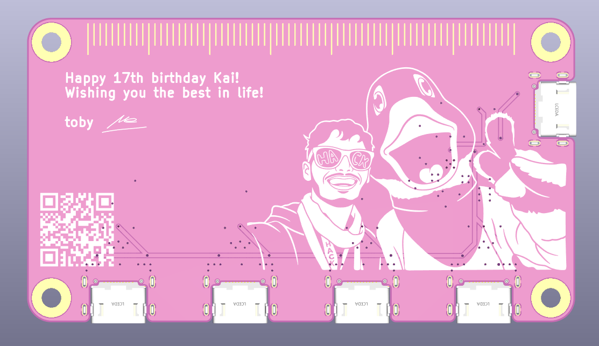
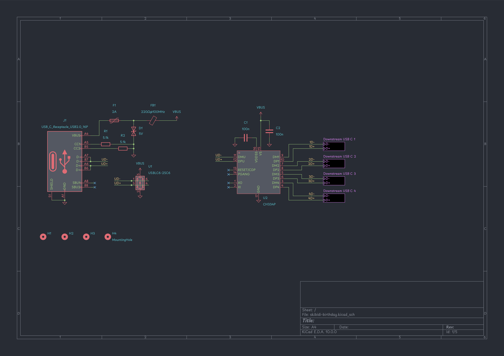
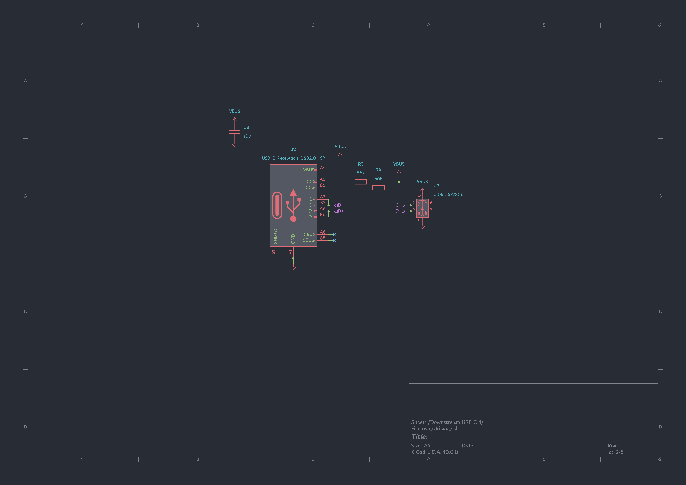

# skibidi-birthday

Happy birthday [Kai](https://github.com/KaiPereira)!! I wanted to put some FPGA footprint stuff but its too advanced for me lol. Hope you enjoy this card gift.

This is a USB 2.0 Hub, it doesn't need to have a case because the pcb itself is a birthday card, having a case would obviously hides the decorations and art on the pcb so it makes sense to not have a case designed.

[\[Blueprint\]](https://blueprint.hackclub.com/projects/13659) | [\[KiCanvas\]](https://kicanvas.org/?repo=https%3A%2F%2Fgithub.com%2Ftobycm%2Fskibidi-birthday%2Ftree%2Fmain%2Fpcb)

## PCB

2-Layer PCB, ENIG finish and white color with black silkscreen

## Schematic

# BOM

BOM is optimized for LCSC to help remove handling fee

| Description | Quantity | Part # | Unit Price | Extended Price (USD) | Product Link |
| :--- | :---: | :--- | :---: | :---: | :--- |
| 100nF ±10% 50V Ceramic Capacitor X7R 0603 | 100 | CL10B104KB8NNNC | 0.0028 | 0.28 | [Link](https://www.lcsc.com/product-detail/C1591.html) |
| 18.6VC Clamp 9.4A@8/20us Ipp ESD DIODE SOD-523 | 20 | ESD5Z5.0T1G | 0.0354 | 0.71 | [Link](https://www.lcsc.com/product-detail/C82044.html) |
| Polymeric PTC Resettable Fuse 12V 2A Surface Mount 1206 | 10 | BSMD1206-200-12V | 0.0616 | 0.62 | [Link](https://www.lcsc.com/product-detail/C883135.html) |
| 220Ω@100MHz 1 Line Ferrite Bead 0805 2A 45mΩ | 50 | BLM21PG221SN1D | 0.0229 | 1.15 | [Link](https://www.lcsc.com/product-detail/C85840.html) |
| USB-C (USB TYPE-C) Receptacle Connector 16 Position Surface Mount | 25 | TYPE-C-31-M-14 | 0.3534 | 8.84 | [Link](https://www.lcsc.com/product-detail/C223907.html) |
| 5.1kΩ ±1% 100mW 0603 Thick Film Resistor | 100 | FRC0603F5101TS | 0.0012 | 0.12 | [Link](https://www.lcsc.com/product-detail/C2907044.html) |
| 56kΩ ±1% 100mW 0603 Thick Film Resistor | 100 | 0603WAF5602T5E | 0.0013 | 0.13 | [Link](https://www.lcsc.com/product-detail/C23206.html) |
| 4 480Mbps USB 2.0 Hub QFN-16(3x3) Interface Controllers | 6 | CH334P | 0.4538 | 2.72 | [Link](https://www.lcsc.com/product-detail/C5373042.html) |
| 12VC Clamp 4.5A Ipp ESD DIODE SOT-23-6L | 40 | USBLC6-4SC6-ES | 0.0216 | 0.86 | [Link](https://www.lcsc.com/product-detail/C5180279.html) |
| **LCSC Shipping** | 1 | LCSC Shipping | 26.06 | 26.06 | [Link](https://www.lcsc.com/) |
| **2-Layer PCB** | 5 | PCB | 3.80 | 19.00 | [Link](https://jlcpcb.com/) |
| **Stencil** | 1 | Stencil | 3.05 | 3.05 | [Link](https://jlcpcb.com/) |
| **JLCPCB Shipping** | 1 | JLCPCB Shipping | 9.69 | 9.69 | [Link](https://jlcpcb.com/) |
| --- | --- | --- | --- | --- | --- |
| **Total** | | | | **$73.22** | |

 <a href="https://github.com/tobycm">tobycm</a>

This project was funded by [Blueprint](https://blueprint.hackclub.com/), a grant program by Hack Club that supports open source hardware projects for teenagers.
